# Rapport de Laboratoire : Bypass de la Détection Root Android avec Medusa

## Introduction
Ce laboratoire présente la réalisation d'un bypass de la détection root sur une application Android en utilisant l'outil **Medusa**. L'objectif est de neutraliser les mécanismes de vérification de l'état "rooté" de l'appareil pour permettre l'exécution normale de l'application.

---

## Étape 1 : Préparation de l'Environnement

### 1.1 Vérification des outils nécessaires
Avant de commencer, nous vérifions que Python, ADB et Frida sont correctement installés sur le système.

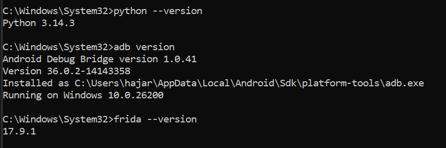

### 1.2 Connexion de l'appareil
Nous vérifions la connexion de l'appareil Android (émulateur) via ADB et identifions son architecture CPU pour choisir la version appropriée de Frida Server.

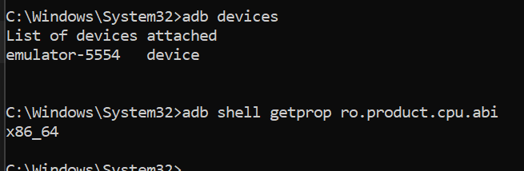

---

## Étape 2 : Déploiement de Frida Server

Pour que Medusa puisse interagir avec l'application, nous devons exécuter `frida-server` sur l'appareil cible. Nous le poussons dans `/data/local/tmp`, modifions ses permissions et le lançons.

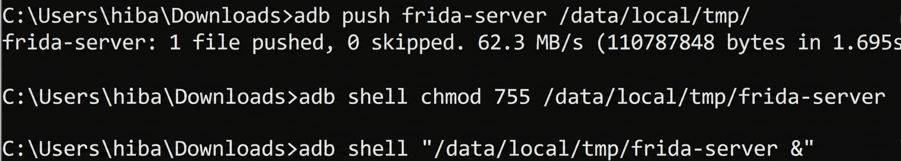

Une fois lancé, nous pouvons lister les processus en cours sur l'appareil pour confirmer la communication.

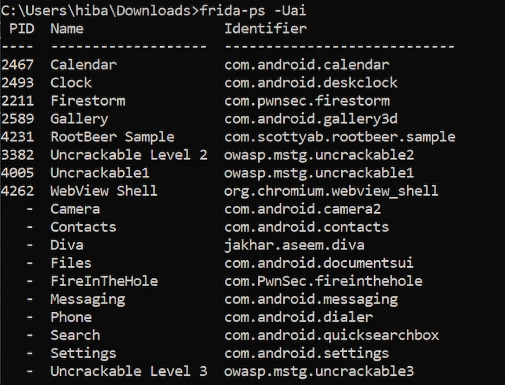

---

## Étape 3 : Installation de Medusa

Nous procédons au clonage du dépôt Medusa depuis GitHub et installons les dépendances Python nécessaires.

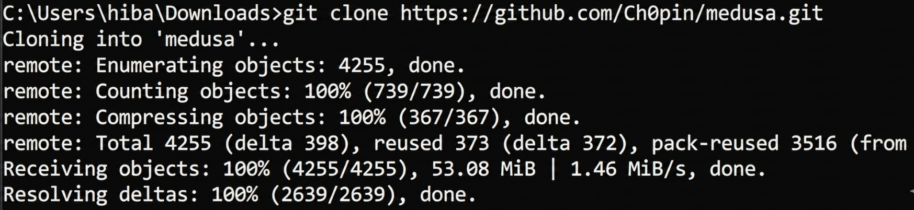
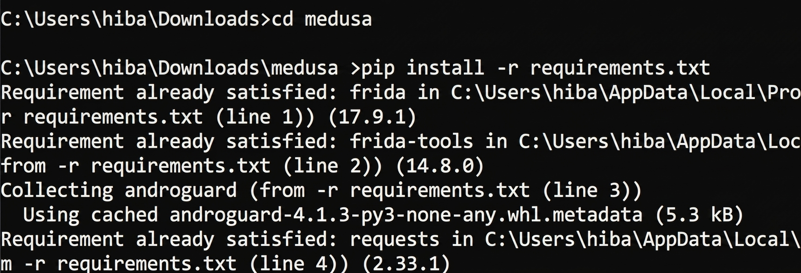

---

## Étape 4 : Analyse et Identification de la Cible

### 4.1 État initial de l'application
L'application cible, **RootBeer Sample**, détecte immédiatement que l'appareil est rooté.

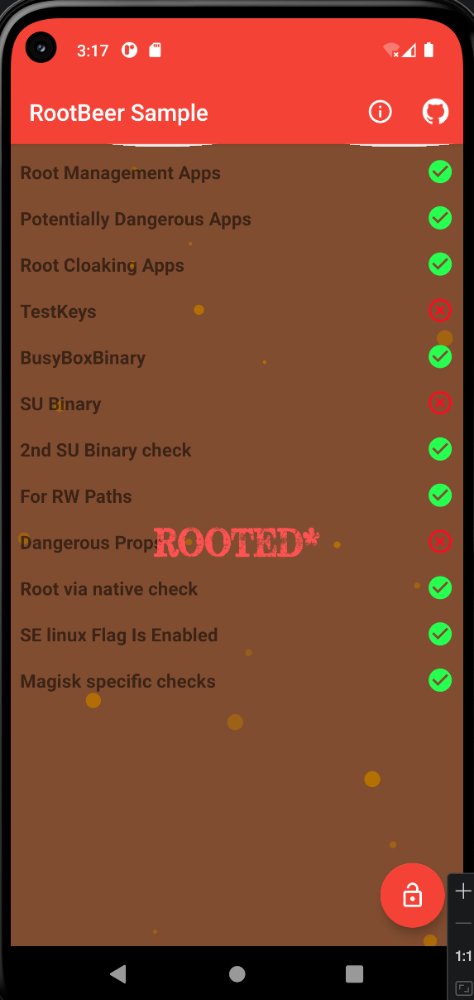
### 4.2 Lancement de Medusa
Nous lançons le script `medusa.py`, sélectionnons l'appareil USB/Émulateur et listons les applications installées pour identifier le package de la cible : `com.scottyab.rootbeer.sample`.

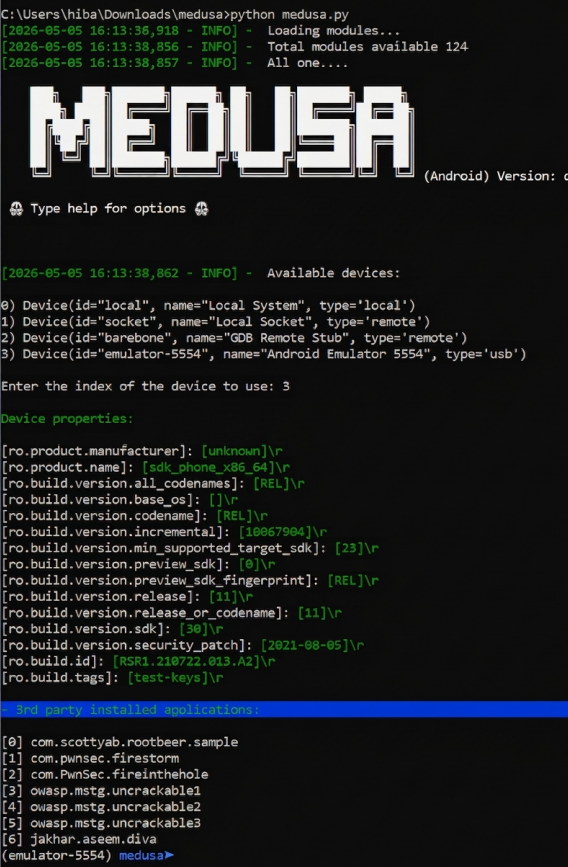

---

## Étape 5 : Réalisation du Bypass

### 5.1 Recherche du module de bypass
Nous recherchons les modules disponibles dans Medusa capables de bypasser la détection root.

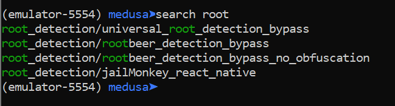

### 5.2 Activation du module spécifique
Nous sélectionnons le module `root_detection/rootbeer_detection_bypass_no_obfuscation` qui est spécifiquement conçu pour l'application RootBeer.

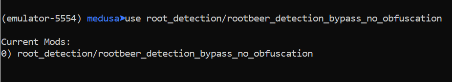

### 5.3 Exécution du script de bypass
Nous lançons l'application via Medusa. Les logs montrent l'installation des "hooks" sur les différentes méthodes de détection (checkForSuBinary, checkSuExists, etc.).

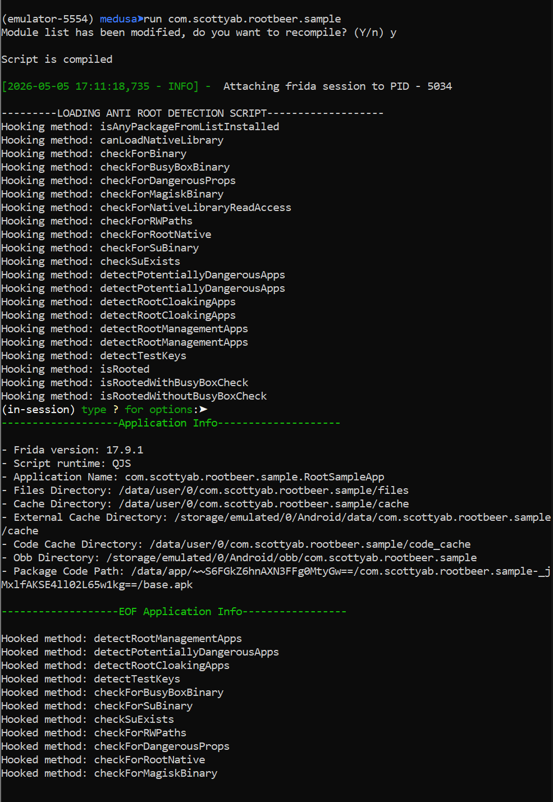
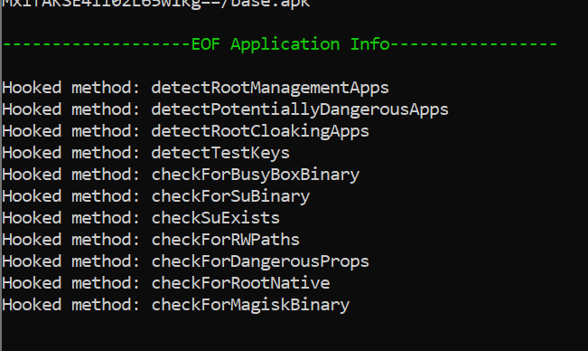

---

## Étape 6 : Validation du Résultat

Après l'injection du script par Medusa, l'application RootBeer Sample affiche désormais un état **"NOT ROOTED"**. Le bypass est réussi.

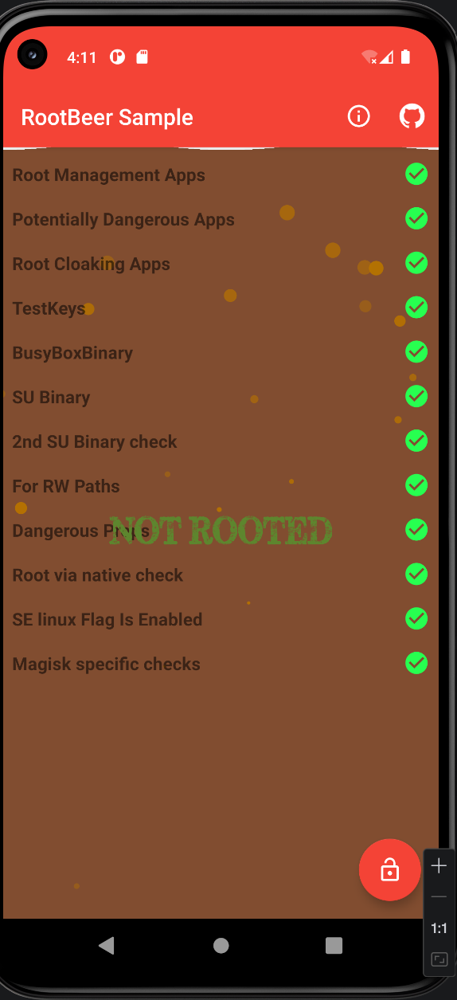
